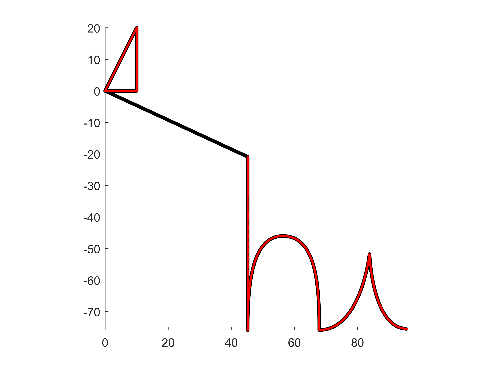
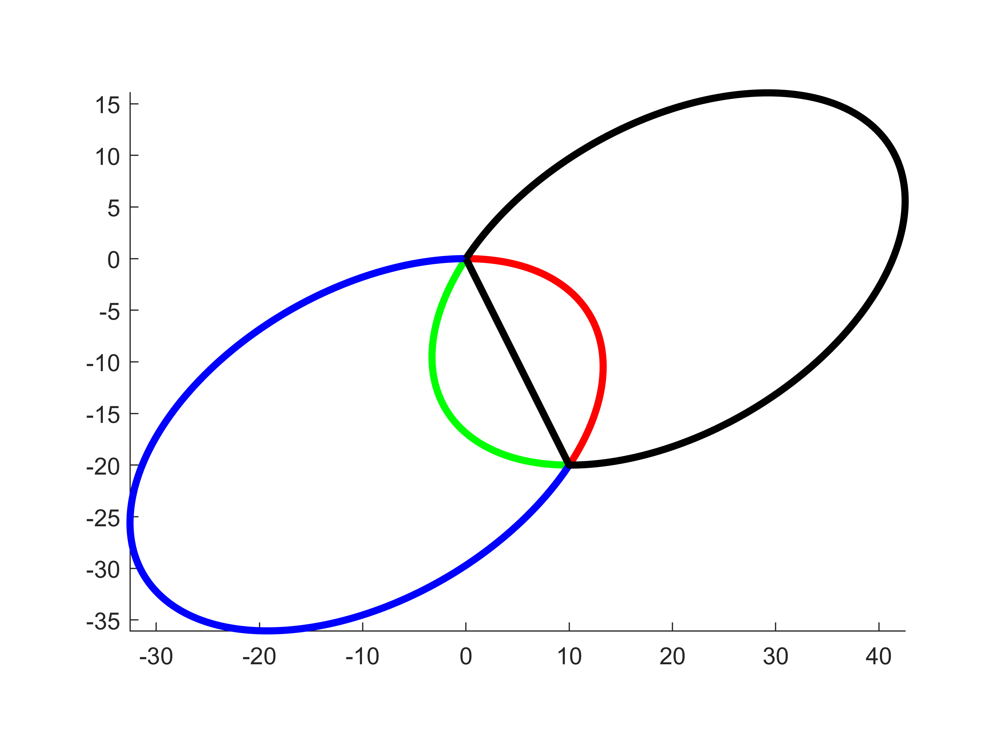

# svg2points
 
This code converts SVG path data to a series of points in Matlab.
I personally like to use [Inkscape](https://inkscape.org/es/) to edit and create SVG files. It is free and works on most operating systems.
To use this utility pass in the string of the svg path (by opening the corresponding svg file in your favorite text editor) and specify a number of points each path's segment should be devided into.

Currently the following modes are supported in their relative (lower case letters) and absolute (upper case letters) version

| Input  | Description | Parameters | Example |
| ------------- | ------------- | ------------- | ------------- |
| `M` | move without drawing path | tupel of points (x,y) | `M 10,20` |
| `H` | horizontal line | length of line | `H 10` |
| `V` | vertical line | length of line | `V 20` |
| `L` | line | length of line as a Tupel (x,y) | `L 10,20` |
| `C` | curve | bezier  curve  specified by three tuples (CP1x,CP1y) (CP2x,CP2y) (xend,yend) i.e. two control points followed by the end point| `C 100,100 250,100 250,200` |
| `A` | arc | arc specified by a tuple specifying the arc's X and Y radius, the rotation angle of the arc, the large-arc-flag, the sweep-flag, and the end point as a tuple. The two flags are needed to select one of the four possible arcs to connect the start and end point | `A 25,15 -30 0 1 10,20` |
| `Z` | closes current path using a line segment | - | `L 10,20 V -10 Z` |

If more inputs then necessary are provided the same type of path is assumed.
However, if a moveto `M` is followed by multiple pairs of coordinates, the subsequent pairs are treated as implicit lineto `L` commands. For more infomation see this [reference](https://www.w3.org/TR/SVG/paths.html).

## Demo
The following plots were created using the demo.m file.

